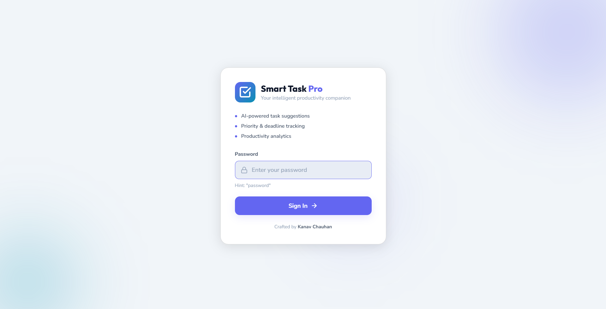
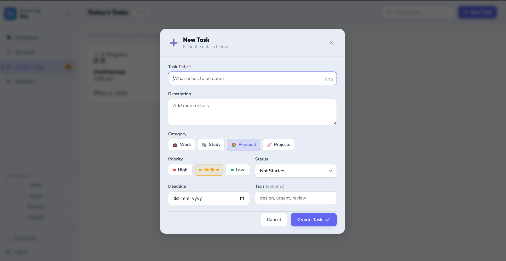
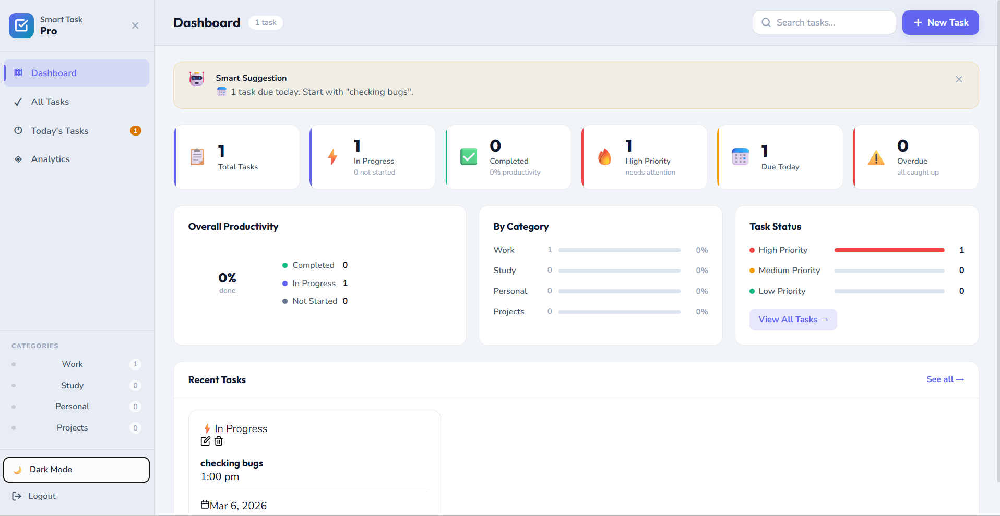

# Smart Task Management 📋

A professional, feature-rich task management application built with React.js. Organize, track, and manage your tasks efficiently with an intuitive interface.


## 🚀 Live Demo

[View Live Application](https://smart-task-pro-sigma.vercel.app/) 

## ✨ Features

### Core Functionality
- ✅ **CRUD Operations** - Create, Read, Update, and Delete tasks
- 🎨 **Status-Based Coloring** - Visual distinction between task states
- 🔍 **Advanced Filtering** - Filter tasks by status
- 📊 **Smart Sorting** - Sort tasks by status (Ascending/Descending)
- 📄 **Pagination** - Navigate through tasks with ease (6 tasks per page)
- 💾 **Local Storage** - Automatic caching and data persistence

### User Interface
- 🌈 **Modern Design** - Clean, professional, and responsive interface
- 📱 **Mobile Responsive** - Works perfectly on all devices
- 🎯 **Intuitive UX** - User-friendly with smooth animations
- 📊 **Dashboard Stats** - Real-time task statistics
- 🔔 **Toast Notifications** - Instant feedback for all actions

### Security
- 🔐 **Authentication** - Secure login system
- 🛡️ **Protected Routes** - Dashboard accessible only after login
- 💼 **Session Management** - Persistent login state

## 📸 Screenshots

### Login Interface

*Secure and user-friendly login screen for accessing the task management system*

### Task Plan Output

*Organized task planning dashboard showing schedules, priorities, and progress*

### Page Interface

*Clean and responsive main interface for smooth navigation and productivity*

> **Note:** Add actual screenshots to a `/screenshots` folder in your repo

---

### Login Page
Clean and secure authentication interface

### Dashboard
Comprehensive task management with stats and filters

### Task Management
Create, edit, and organize tasks efficiently

## 🛠️ Built With

- **React.js 18.2.0** - Frontend framework
- **React Router DOM** - Navigation and routing
- **React Toastify** - Toast notifications
- **Bootstrap 5.3.3** - UI components and styling
- **Context API** - State management
- **Local Storage** - Data persistence

## 📋 Task Status Types

| Status | Color | Description |
|--------|-------|-------------|
| 🔵 Not Started | Gray | Tasks that haven't been started yet |
| 🟡 In Progress | Orange | Tasks currently being worked on |
| 🟢 Finished | Green | Completed tasks |

## 🎯 Getting Started

### Prerequisites

- Node.js (v14.0.0 or higher)
- npm (v6.0.0 or higher)

### Installation

1. **Clone the repository**
```bash
git clone https://github.com/yourusername/smart-task-management.git
cd smart-task-management
```

2. **Install dependencies**
```bash
npm install
```

3. **Start development server**
```bash
npm start
```

The application will open at `http://localhost:3000`

### Login Credentials

```
Password: password
```

## 📦 Build for Production

```bash
npm run build
```

This creates an optimized production build in the `build` folder.

## 🌐 Deployment

### Vercel (Recommended)

1. Push your code to GitHub
2. Import project in Vercel
3. Configure:
   - **Framework Preset**: Create React App
   - **Build Command**: `npm run build`
   - **Output Directory**: `build`
4. Deploy!

### Netlify

1. Push your code to GitHub
2. Connect repository to Netlify
3. Configure:
   - **Build command**: `npm run build`
   - **Publish directory**: `build`
4. Deploy!

## 📱 Features Walkthrough

### 1. **Dashboard Overview**
- View total tasks and status breakdown
- Quick stats at a glance
- Real-time updates

### 2. **Task Management**
- **Create**: Click "Add New Task" to create
- **Read**: View all tasks in a grid layout (2 per row)
- **Update**: Click edit icon to modify task details
- **Delete**: Click delete icon with confirmation

### 3. **Filtering & Sorting**
- Filter by: All, Not Started, In Progress, Finished
- Sort by: None, Status Ascending, Status Descending
- Instant results

### 4. **Pagination**
- 6 tasks per page for optimal viewing
- Easy navigation between pages
- Smart page number display

## 🎨 Customization

### Colors

Edit `src/styles/App.css` to customize the color scheme:

```css
:root {
  --primary-color: #4f46e5;
  --secondary-color: #10b981;
  --danger-color: #ef4444;
  --warning-color: #f59e0b;
}
```

### Tasks Per Page

Edit `src/context/TaskContext.jsx`:

```javascript
const tasksPerPage = 6; // Change this number
```

## 📂 Project Structure

```
smart-task-management/
├── public/
│   ├── index.html
│   └── manifest.json
├── src/
│   ├── components/
│   │   ├── Login.jsx
│   │   ├── Dashboard.jsx
│   │   ├── Task.jsx
│   │   ├── TaskForm.jsx
│   │   ├── TaskList.jsx
│   │   └── Pagination.jsx
│   ├── context/
│   │   └── TaskContext.jsx
│   ├── styles/
│   │   ├── App.css
│   │   ├── Login.css
│   │   ├── Dashboard.css
│   │   └── Task.css
│   ├── App.js
│   └── index.js
├── package.json
└── README.md
```

## 🔧 Available Scripts

- `npm start` - Run development server
- `npm run build` - Create production build
- `npm test` - Run tests
- `npm run eject` - Eject from Create React App

## 💡 Tips

- Tasks are automatically saved to localStorage
- Use keyboard shortcuts: Enter to submit forms, Escape to close modals
- The app works offline after first load
- Clear browser cache if experiencing issues

## 🐛 Known Issues

None at the moment! Report issues [here](https://github.com/yourusername/smart-task-management/issues).

## 🚧 Future Enhancements

- [ ] Dark mode toggle
- [ ] Task priority levels
- [ ] Due dates and reminders
- [ ] Task categories/tags
- [ ] Search functionality
- [ ] Export tasks to CSV/PDF
- [ ] Drag and drop reordering
- [ ] Collaborative features
- [ ] Backend integration

## 📄 License

This project is licensed under the MIT License - see the [LICENSE](LICENSE) file for details.

## 👤 Author

**Kanav Chauhan**

- GitHub: [@KanavChauhan23](https://github.com/KanavChauhan23)
- LinkedIn: [kanavchauhan23](https://www.linkedin.com/in/kanavchauhan23/)
- Email: kanavchauhan23@gmail.com

## 🙏 Acknowledgments

- Inspired by modern task management applications
- Built with Create React App
- Icons from Lucide Icons
- UI inspired by contemporary design trends

## 📞 Support

For support, email kanavchauhan23@gmail.com or open an issue in the repository.

---

⭐ **Star this repo if you find it helpful!**

Made with ❤️ by Kanav Chauhan
